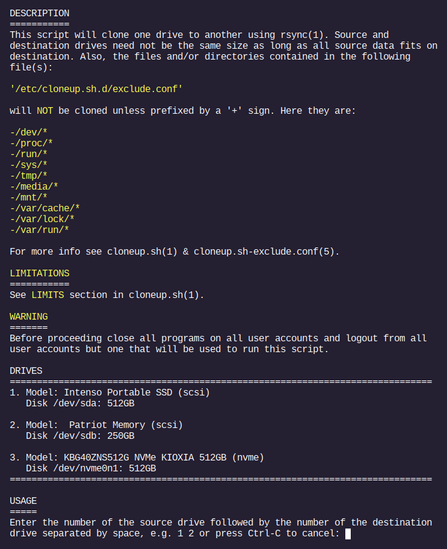

# archlinux

Configuration files and scripts from my Arch Linux laptop, plus **cloneup**, a Bash tool I wrote that clones one drive to another and leaves the copy ready to boot.

> **If you've come here from my CV:** the part of this repository worth your time is [cloneup](#cloneup). It's a practical tool I use myself, and it's the best example here of how I write Bash: about 2,600 lines of code organised into functions and a shared library, with nearly 700 lines of comments, two man pages, and a terminal interface built to be easy to use. The rest of the repository is configuration for my own machine.

## cloneup

cloneup copies an entire drive, partition by partition, to another drive. It copies files with `rsync` instead of making a raw block-level copy, and that choice is what makes its main features possible.



*cloneup's opening screen. You pick the source and destination by typing their numbers.*

### What it does that a plain disk copy doesn't

- **The copy boots.** After cloning, cloneup rewrites everything in the boot setup that points at the source drive: UUIDs and device names in `fstab`, the GRUB configuration and `grubenv`, and the kernel command line, including the resume offset for hibernating to a swap file. It then installs GRUB on BIOS systems, or adds UEFI boot entries for a fixed (non-removable) drive, so the destination can be booted straight away.
- **The destination can be a different size.** Partitions are scaled to fit the destination drive. If the destination is smaller and a scaled partition would be too small for its data, cloneup sizes each resizable partition from the data it actually holds, plus a share of the free space. EFI, BIOS-boot and swap partitions keep their original size, and every partition is aligned for the destination drive. The only requirement is that the data fits, and cloneup checks this, after exclusions, before it touches anything.
- **Running it again updates the copy.** If the destination already has the partition layout cloneup would create, for example because it holds an earlier clone, cloneup skips repartitioning and `rsync` transfers only what has changed. Refreshing a backup drive is much faster than the first clone.

### Other features

- **Interactive or scripted.** With no options, cloneup lists the connected drives by number and you type the source and destination, such as `1 2`. For scripts, pass the drives with `-s` and `-d`.
- **Dry run.** `-r` prints every command cloneup would run, without running any of them.
- **Safety checks.** cloneup won't use the drive the system booted from, or the drive it's running from, as the destination. It validates your choice and lets you re-enter it, and it notices if the list of drives changes while it's waiting.
- **Several clones at once.** You can clone one drive to several others in parallel from separate terminals. A lock file, managed with `flock`, stops two sessions from writing to the same drive.
- **Progress and logs.** Partitions are copied in parallel, with `rsync` progress on screen. Each session logs the files copied, any errors and the commands it ran, under `/var/log/cloneup.sh.d/`.
- **No surprises mid-clone.** On systemd systems, sleep, shutdown and the lid switch are blocked until cloning finishes. Ctrl-C cancels cleanly at any point.
- **Configurable exclusions.** An exclude file controls what is left out, with include rules for exceptions. cloneup reports and drops rules that cancel out or duplicate each other. Settings are layered: system defaults, local overrides, per-user files, or a file named on the command line.
- **Swap handled properly.** Swap partitions and swap files are recreated on the destination rather than copied, and the configuration is updated to match.
- **Documented.** The man pages `cloneup.sh(1)` and `cloneup.sh-exclude.conf(5)` cover usage, configuration, logs and limitations.

### Usage

cloneup must be run as root.

```bash
sudo cloneup.sh                            # interactive: pick drives from a numbered list
sudo cloneup.sh -r                         # dry run: show the commands without running them
sudo cloneup.sh -s /dev/sda -d /dev/sdb    # non-interactive, for scripts
```

| Option | Description |
|---|---|
| `-s`, `--src` *drive* | Source drive, e.g. `/dev/sda` (use with `-d`) |
| `-d`, `--dst` *drive* | Destination drive, e.g. `/dev/sdb` (use with `-s`) |
| `-e`, `--exclude` *file* | Use a custom exclude file |
| `-f`, `--fstypes` *file* | Use a custom file of formatting commands (advanced) |
| `-r`, `--dry-run` | Print the commands without running them |
| `-w`, `--wait` | Wait for a key press before exiting, so the terminal stays open (used by the desktop launcher) |
| `-h`, `--help` | Show a short help message |

See `man cloneup.sh` and `man cloneup.sh-exclude.conf` for full details.

### Installing

The repository mirrors the filesystem, so each file goes to the same path under `/`. From the repository root:

```bash
sudo install -Dm755 usr/sbin/cloneup.sh             /usr/sbin/cloneup.sh
sudo install -Dm755 usr/lib/cloneup.sh.d/cloneup.sh /usr/lib/cloneup.sh.d/cloneup.sh
sudo install -Dm644 usr/lib/cloneup.sh.d/lib.sh     /usr/lib/cloneup.sh.d/lib.sh
sudo install -Dm644 -t /etc/cloneup.sh.d etc/cloneup.sh.d/*
sudo bash usr/share/man/manpages.sh   # builds and installs the man pages
```

To start cloneup from an icon, copy `~/Desktop/clone.desktop` to your desktop. It opens a terminal and runs `sudo cloneup.sh -w`.

### Requirements and limitations

- Bash 4.3 or later, `rsync`, `parted`, `bc`, util-linux and systemd, plus the `mkfs` tools for the filesystems on the source drive (see `fstypes.conf`).
- A bootable copy requires the source to boot with GRUB 2, and `efibootmgr` on UEFI systems. Either way, the destination gets all the data.
- The source drive must not use LVM, and its partitions must have UUIDs.
- Btrfs subvolumes are not recreated on the destination.

### How it works

The main loop reads almost like a summary of the program (simplified here from `usr/lib/cloneup.sh.d/cloneup.sh`):

```bash
usage             &&  # show the exclusions and the connected drives
user_input        &&  # read and validate the source and destination
setup_env         &&  # safety checks, lock file and log directory
populate_arrays   &&  # build the data structures used for cloning
calc_drvspace     &&  # check that the source data fits on the destination
create_partitions &&  # repartition and format the destination if needed
clone                 # copy each partition with rsync, then update the boot setup
```

Every command that changes a drive goes through one function, `exec_cmds` in `lib.sh`. It logs the command, runs long jobs such as `rsync` in the background and waits for them, handles interruptions, and during a dry run prints the command instead of running it.

### Where to start reading the code

| Where | What it shows |
|---|---|
| `calc_drvspace` in `cloneup.sh` | Measuring the data to copy, and turning the exclude rules into `rsync` filters |
| `create_partitions` in `cloneup.sh` | Sizing and aligning partitions for a destination of a different size |
| `clone` in `cloneup.sh` | Running `rsync` per partition, and updating `fstab`, GRUB and UEFI boot entries |
| `exec_cmds` in `lib.sh` | Command execution, logging, dry runs, background jobs and signal handling |
| `usr/sbin/cloneup.sh` | The wrapper: option handling and blocking sleep with `systemd-inhibit` |

### Files

```text
usr/sbin/cloneup.sh               wrapper: checks, sleep blocking, --wait option
usr/lib/cloneup.sh.d/cloneup.sh   main script
usr/lib/cloneup.sh.d/lib.sh       shared functions
etc/cloneup.sh.d/exclude.conf     files and directories left out of the clone
etc/cloneup.sh.d/fstypes.conf     maps parted filesystem names to mkfs commands
usr/share/man/cloneup             man page source for cloneup.sh(1)
usr/share/man/cloneup-exclude     man page source for cloneup.sh-exclude.conf(5)
usr/share/man/manpages.sh         builds and installs the man pages
~/Desktop/clone.desktop           desktop launcher
```

## The rest of the repository

The other files are configuration for my own laptop, laid out the same way (`etc/` and `usr/` mirror `/etc` and `/usr`):

- **Secure Boot:** pacman and mkinitcpio hooks that sign GRUB and the kernel, and copy the shim to the EFI system partition
- **GRUB:** boot settings, and a password required to edit boot entries but not to boot them
- **Graphics and power:** NVIDIA hybrid-graphics switching, and systemd and polkit settings for suspend and hibernation
- **Package maintenance:** cache cleaning, file-database refresh, keyring sync, and mirror-list updates with orphan-package removal
- **Admin scripts:** adding and removing users and running virus scans (each with a desktop launcher), and copying Kodi settings between user accounts
- **Networking:** automatic time-zone updates when the network connects
- **Notes:** my routine for cloning and updating the system (`clone_and_update.txt`), and notes on a bootable Arch USB drive (`bootable_usb.txt`)

These files are tailored to one machine and aren't meant as a general-purpose setup.

## Author

Markos Perrakis — [github.com/mperrakis2](https://github.com/mperrakis2)
